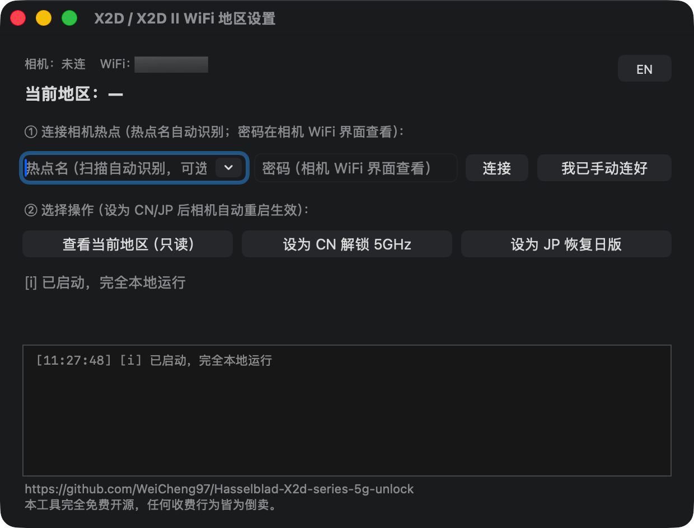
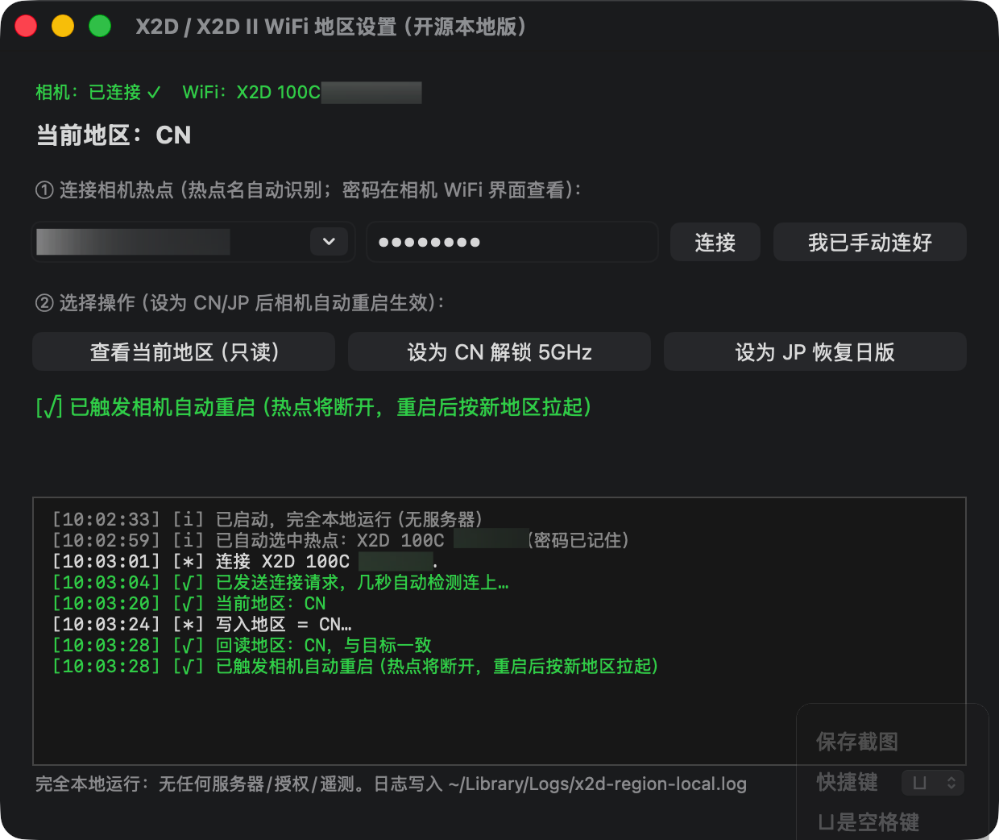
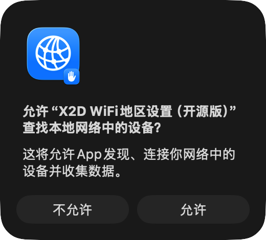

# X2D / 907 WiFi Region Tool (Open-Source, Fully Local)

**[中文版 README](README.md)** | English

> **This tool is free and open source — anyone charging for it is reselling.** Only official repo: https://github.com/WeiCheng97/Hasselblad-X2d-series-5g-unlock

Read and change the **WiFi region** (wifiRegion) of Hasselblad X2D / X2D II / 907X & CFV 100C cameras over the camera's own WiFi hotspot, using the camera's built-in factory diagnostic channel — to lift the **5GHz WiFi restriction** on Japanese-region cameras, and to restore the original region at any time.

- **Fully local**: no servers, no accounts, no activation codes, no telemetry.
- **No flashing, no firmware changes**: it adjusts a single factory parameter via the camera's own diagnostic command, and you can change it back anytime.
- Actions: query current region, set CN (unlock 5GHz), set JP (restore), and the camera is **automatically rebooted** after writing so the new region takes effect.



---

## Quick Start

### Option 1: Windows / Mac GUI

Download from the [**Releases page**](https://github.com/WeiCheng97/Hasselblad-X2d-series-5g-unlock/releases/latest) (binaries are not kept in the source repo):

| File | Platform |
|---|---|
| `X2D_WiFi地区设置_win.exe` | Windows 10/11 x64, single-file executable |
| `X2D_WiFi地区设置_mac.zip` | macOS 12+ (Intel / Apple Silicon) — unzip and run (allow it in Privacy & Security on first launch) |
| `X2D_WiFi地区一键设置.command` | Minimal macOS alternative — double-click to run (uses the stock Perl, nothing to install) |

> ⚠️ **The Windows GUI has not been tested on a real machine** (auto-join uses a temporary `netsh` profile; behavior may vary across Windows versions and Wi-Fi drivers).
> If the Windows version gives you trouble, use the **Python CLI** (Option 2 — cross-platform, zero dependencies), or join the camera hotspot manually in Windows Settings and then run the Python script.

Steps:

1. **Open the WiFi hotspot on the camera** (camera menu → WiFi → Hotspot; the hotspot name and password are shown on the camera's WiFi screen).
2. Connect your computer to that hotspot (the GUI auto-scans and fills the hotspot name; type the password once and it's remembered on this machine forever — or connect manually in System Settings and click "I'm connected").
3. Choose an action:
   - **Query region** (read-only, safe)
   - **Set CN (unlock 5GHz)**
   - **Set JP (restore)** (rollback)
4. The camera **reboots automatically** after writing; the new region takes effect.

What a successful run looks like (write → readback matches → camera reboot triggered):



> 💡 **On first launch, macOS asks "Allow this app to find devices on your local network"** — click Allow (needed to scan for the camera hotspot; this app collects no network data):
>
> 

### Option 2: Python CLI (cross-platform, zero dependencies)

```bash
# Connect to the camera hotspot first, then:
python3 src/x2d_wifi_region.py              # read current region (safe)
python3 src/x2d_wifi_region.py --set 6      # set CN (unlock 5GHz)
python3 src/x2d_wifi_region.py --set 8      # set JP (restore)
python3 src/x2d_wifi_region.py --set 6 --reboot   # write and auto-reboot the camera
python3 src/x2d_wifi_region.py --host 192.168.2.1 # specify camera IP
```

---

## How It Works (protocol fully documented)

Channel (byte-identical on X2D v4.2.0 and X2D II v1.3.16.2, verified by firmware reverse engineering; community-tested on CFV 100C v4.0.0):

```
Computer ──TCP 30303 (raw frames, no framing, no auth)──> msg2dbus (NetIO)
    ──signal 0x05 tcphost_testrx_event (origin=9, dest=5)──> D-Bus
    ──> camera-test (testd, always-on root factory test daemon)
    ──command 49 ProdConfig ──> property 13 = wifiRegion
    ──> /factory_data/settings.ini  [Identity] WifiRegion
```

**Frame format (257 bytes, single write)**:

```
[05 00] signal=5 | [09] origin=tcphost | [05] dest=eagle | [fc] type=252
sutest_cmd 252B:
  +00 u32le cmd=49 | +04 u32le func(0=print 1=set 2=get 3=init)
  +08 u32le cookie (echoed in reply) | +0C u32le CRC16-XMODEM(cmd[0x10:0xFC])
  +10 u32le reserved | +14 u32le field=13 | +18 u32le value
Reply: [09 00][05][09][fc] + 252B result
```

**Region values**: `EU=0 US=1 CN=6 JP=8 KR=9 RadioOff=12` (see the source for the full table).
Note: **JP (8) is double-blocked from 5G** (the camera GUI hides the 5G menu AND `dji_network` forces 2.4GHz-only).
The unlock target is **6 (CN)**.

**Reboot (a write only takes effect after a full reboot)**: same channel, `cmd=52 OsSystemCommand`, func=1, command string at `+0x14` NUL-terminated (`/system/bin/reboot`) — goes through init's orderly shutdown (clean reboot; WiFi power state persists, and the hotspot comes back up with the new region).

## Troubleshooting

- **Can't reach camera at 30303**: check ① the computer is on the camera hotspot; ② the hotspot is actually on (wake it with the Phocus phone app over Bluetooth if it's sleeping); ③ `ping 192.168.2.1` works; ④ use `--host` if the camera IP differs.
- **Windows GUI won't open / can't connect / crashes**: the Windows GUI is untested on real hardware (see the warning above). Use the Python script for the same result: `python3 src/x2d_wifi_region.py --set 6 --reboot`.
- **No change after writing**: the region parameter is only re-read at a full camera boot — this tool triggers that reboot automatically; if interrupted, power-cycle the camera fully once.
- **Will it brick my camera?**: No. It's the camera's native factory diagnostic command with legal parameter values, fully reversible. Worst case, reset WiFi in the camera menu or factory-reset.
- **Supported models**: Hasselblad X2D 100C (firmware v4.2.0, tested), X2D II 100C (v1.3.16.2, tested), 907X & CFV 100C (v4.0.0, community-tested; hotspot name looks like `CFV 100C 008987`). Other firmware versions should work identically but are untested.

## Build

- Windows GUI: `cd src/client_local && CGO_ENABLED=0 GOOS=windows GOARCH=amd64 go build -ldflags "-H=windowsgui -s -w" -o X2D_WiFi地区设置.exe .`
- Mac GUI: `cd src/gui_local && swiftc -O -target arm64-apple-macosx12 -o x2d-region-local main.swift` (package into a standard .app; use `-target x86_64-apple-macosx12` for Intel and `lipo` to make a universal binary)
- The `.command` (`src/X2D_WiFi地区一键设置.command`) and the Python tool ship as source — nothing to build.

## Disclaimer

This tool only restores/adjusts the lawful radio configuration of **your own** camera. Please comply with the radio regulations of your country/region.
Not affiliated with Hasselblad. Hasselblad and X2D are trademarks of their respective owners.

## License

MIT (see LICENSE)
